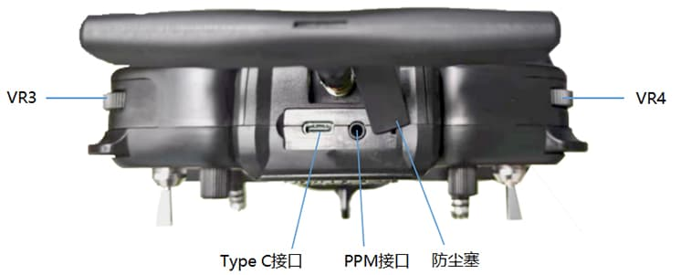

以左手油门为例：

:::caution [重要]

        DRC16的 Type-C 口除了用于升级固件、拷贝数据，还可用于给遥控器临时供电。当遥控器电池没电或操控模拟器时，可以将移动电源或电脑等供电设备连接至遥控器的 Type-C 口，给遥控器5V 供电，然后将遥控器正常开机即可使用。DRC16的 Type-C 口的输入电压最大为 5V，因此 Type-C 口输入电压不能超过5V。

:::
