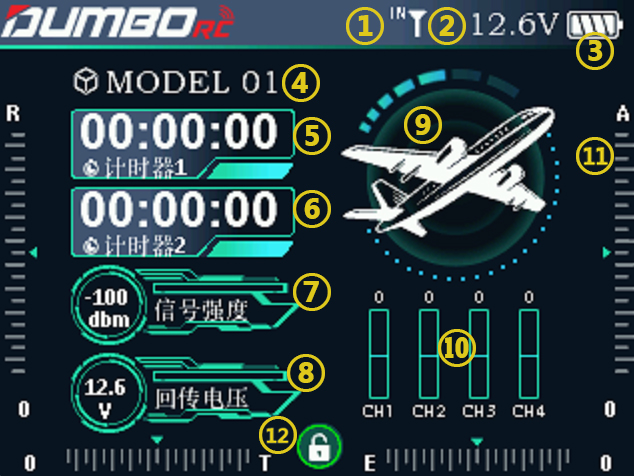
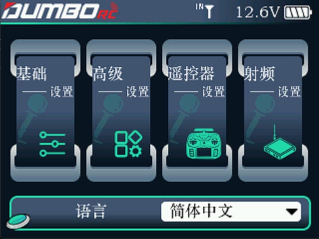

### 开机界面

 

        长按遥控器的电源键开机后，遥控器屏幕会显示如下的内容：         1.模块选择。可在射频设置-外置射频设置里面，设置是否开启外部射频。默认选择内置模块，此时此处会显示IN，如果开启了外置射频，则会显示一个EX，后面的信号塔显示的是信号强度。

:::tip[提示]

外置射频开启方法：射频设置-外置射频设置-外部射频启用。 内置射频开启方法：射频设置-接收机协议-射频开启。

:::

        2.遥控器的电池电压。         3.遥控器电量显示。         4.当前使用的模型名称。您可以在遥控器设置-模型管理里面选择不同的模型，DRC16可以最多支持20组模型存储，操作模型之前，一定要查看显示屏上的模型是否和实际使用的模型一致。如果选错模型，舵机的动作、大小、方向和中立位设置会发生错误，此时操作遥控器，将可能会导致模型受损。         5.计时器1.将滚轮移到计时器1，短按确认键可开启计时或者停止计时，长按确认键可清零复位。         6.计时器2.将滚轮移到计时器2，短按确认键可开启计时或者停止计时，长按确认键可清零复位。         7.接收机的信号强度值，“NULL”表示无信号或接收机和遥控器没有对码成功。RSSI 值越接近0，则信号越强，RSSI 负数数值越大，则信号越弱。         8.模型设备上的动力电池电压。当使用带有回传功能的接收机，且回传线正确连接时，遥控器的屏幕会显示外部电压。         9当前的模型类型。         10.CH1-CH4的通道浏览。         11.以左手油门（美国手）为例，屏幕底部及左右边缘有四个刻度尺标识，当使用固定翼模型时，这些刻度尺标识分别代表了遥控器的副翼、升降、油门以及方向的物理微调，对应遥控器上四个微调开关。注意在首次飞行前调试模型的时候不要使用此微调，此微调适用于模型首次工作途中，调整模型水平飞行时姿态的微调。         12.屏幕锁。将滚轮移动至屏幕锁的位置，长按确认键可上锁或开锁。上锁时，屏幕锁会变成红色，此时所有系统菜单键均不起作用。在遥控器主界面长按确认键开锁后，屏幕锁会变成白色，锁头呈打开的状态，所有按键功能恢复。

### 语言切换

        语言栏可以选择：中文、英语、德语、法语、俄语、韩语等，后续会增加更多语种。
