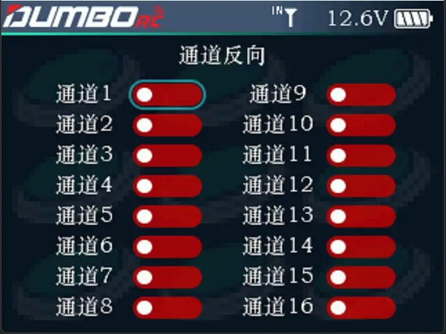

        将一个通道或多个通道输出数据反向处理，此项功能在调试模型中使用。         模型在设计时可能使用不同的标准，当您组装及调试模型时，发现操作模型与要求的方向相反，如想打右方向时模型往左走，此时遥控器的输出信号方向需要调整。此功能用于调整各通道输出信号的`动作方向`。         将光标移至需要修改的通道，短按Push 键即可切换通道相位。

:::tip[提示：]

1.油门、方向如果发现和实际的不一样，就是在这里设置. 2.开关信号如果关和开是反着的，也是在这里切换

:::
