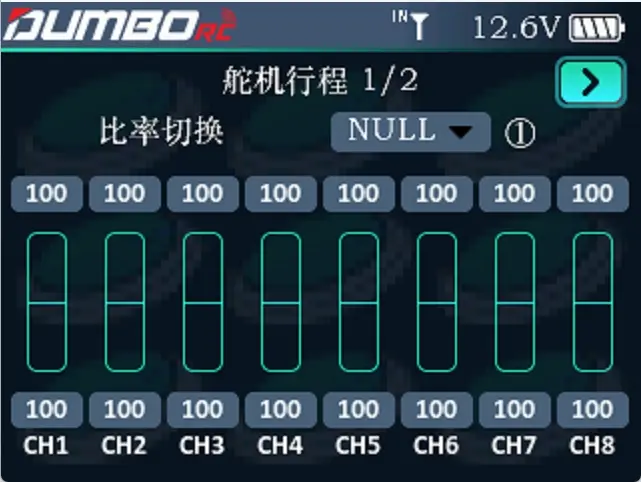
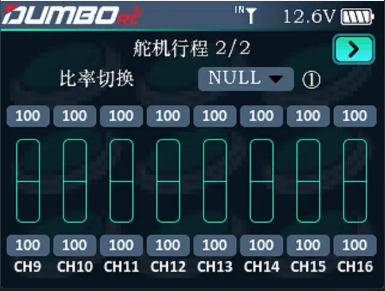

        调整舵机输出的行程量，在调试模型过程中使用此功能。可分别设置各通道高低行程值。 
        因模型在设计时存在结构的尺寸变化及规范不统一及每个操作者的习惯动作大小不同，此功能便可用于设置各通道所需要的行程量进行相应结构匹配调整，以达到最佳与之匹配的操控效果。如在操作时，希望转弯动作不
要过大，可将方向通道的高低端值调小一些。这样转弯动作相应小了，不容易出现摆尾现象。 
        将光标移至需要设置的数值，拨动滚轮即可设置合适的数值，各通道上下行程量可设置范围为0-120。
           
         

        通过显示屏右上角的   `   >   `  翻页键可以进入下一个页面调节CH9-CH16的行程。

比率切换：可以设置一个通道，该通道每个状态可以对应一组(或多组)通道的行程。

:::tip[比率切换]

比率切换类似双比率/大小舵，通过不同的通道状态给某个通道设置不同的行程，类似油门限速、电子变速。

:::

:::tip[提示]

1.调整差速锁、高低速这些操作，就是在这里调节； 2.调节油门行程可以限制油门的输出，方便新手在安全速度下快速入门。

:::

:::caution[注意]

1.调节差速、高低速舵机的时候，行程最好是事先设置为0，然后再左右慢慢加大行程，防止舵机烧毁；

:::
