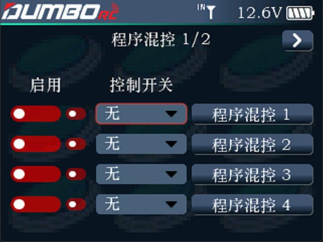
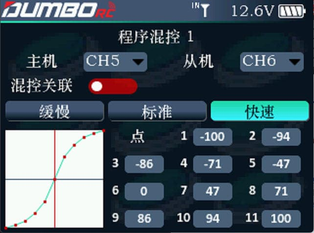

        DRC16支持最多8组程序混控，使用一个混合控制可以达到一个开关同时控制两个通道的效果，每组混控均可以指定一个开关控制。

        启用：是否开启当前的程序混控。         控制开关：设置此组混控的控制开关，可通过下拉菜单选择想要的开关通道。NULL 表示不需要额外的占用一个开关通道去触发当前的混控。

        主机：即主控通道，表示当前混控关系中的控制角色。         从机：即被控通道，表示当前混控关系中的被控制角色。         混控关联：是否加入主机通道的额外功能，如油门速度，转向比率等。例如：混控和关联混控都打开后，主机还设置了油门速度功能并打开，当操作主机通道，不仅从机会按设置的舵量相应，主机通道设置的油门加速功能也会同时生效。         缓慢、标准、快速：输入源(主机)和输出源(从机)的比率关系，标准就是线性比率关系，缓慢就是输入源接近中心点时，输出源输出较缓慢，快速就是输入源接近中心时，输出源输出比较快速。
