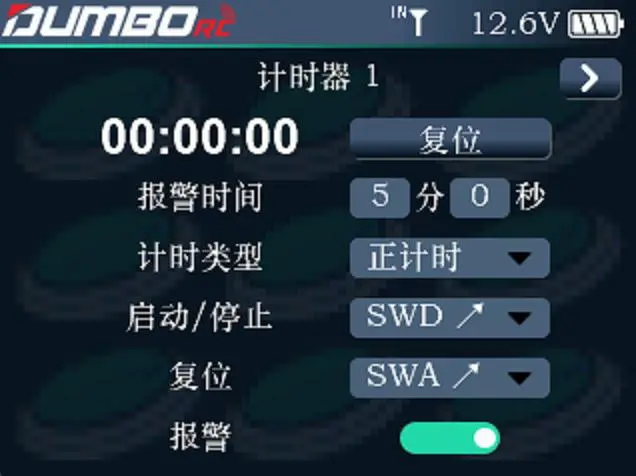

        计时器的显示与控制设置。本遥控器提供 2 个计时器，可分别独立设置，设置方法一样。

        报警时间：报警时长，默认为 5 分钟 0 秒，可根据实际需要进行设置。 

        计时类型：可选择“正计时”和“倒计时”。正计时：从 0 开始；倒计时：从设定的时间开始倒数。 

        启动停止：用于启动计时和停止计时的开关，可选择的开关包括但不限于SWA、SWB、SWC 和 SWD。
        复位：用于计时复位。如果计时已经开始了，推 1 下这个复位按键，计时会从新开始；如果计时停止了，推 1 下复位按键，计时会复位，也就是恢复到之前设置的报警时间。
        报警：当计时时间到达此处设定的时间时，如果是开启，遥控器在设置的时间到后开始发出报警，不开启的话，则在每次计时结束后，不报警提示。

        注意：每次计时结束，需要推 1 下复位按键，将计时复位，然后才能开始下一次计时。
        

        通过显示屏右上角的 `>` 翻页键可以进入下一个页面设置第二组计时器，方法可参考计时器1。
