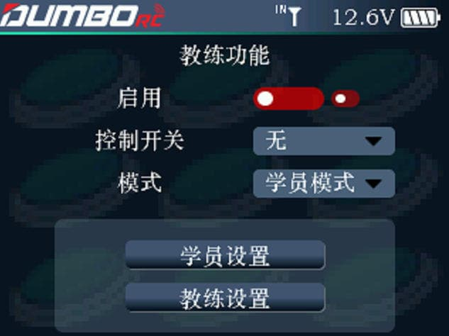

        启用：用于开启或关闭教练功能。         电源输出：当使用教练模块，通过无线连接的方式连接学员和教练机时，插入TYPE C接口的教练模块的供电是可以通过这个开关控制的。开启，则教练模块通电工作，关闭，则教练模块停止工作。         控制开关：可选择下拉选项里面的各通道开关，用于切换学员机和教练机之间的信号控制，NULL表示无开关控制。         模式：教练模式和学员模式。被设置为教练模式的发射机接受外部信号控制模型，即教练口具备识别外部 PPM 信号输入能力，同时识别正常连接的无线教练模块；被设置为学员模式的发射机仅输出 PPM 信号，不识别输入
信号，也不能识别接入的无线教练模块。两台发射机（一台教练模式一台学员模式）可通过教练线连接，也可通过无线教练模块实现连接。

:::caution[注意]

1. 飞行前请先地面验证舵面反馈和电机反馈均为正常； 
2. 若通过教练线连接两台发射机，请确保教练线连接正确；若通过无线教练模块连接，请确保无线教练模块正确连接且正常通讯； 

:::

### 教练模式

        本机作为教练机使用，
