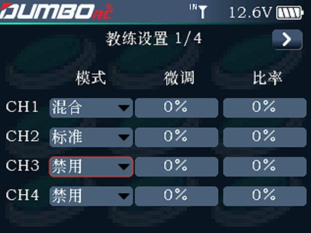

 

      启用：用于开启或关闭教练功能。        电源输出：当使用教练模块，通过无线连接的方式连接学员和教练机时，插入TYPE C接口的教练模块的供电是可以通过这个开关控制的。开启，则教练模块通电工作，关闭，则教练模块停止工作。        控制开关：可选择下拉选项里面的各通道开关，用于切换学员机和教练机之间的信号控制，NULL表示无开关控制。        模式：教练模式和学员模式。被设置为教练模式的发射机接受外部信号控制模型，即教练口具备识别外部 PPM 信号输入能力，同时识别正常连接的无线教练模块；被设置为学员模式的发射机仅输出 PPM 信号，不识别输入
信号，也不能识别接入的无线教练模块。两台发射机（一台教练模式一台学员模式）可通过教练线连接，也可通过无线教练模块实现连接。

:::caution[注意]

1. 飞行前请先地面验证舵面反馈和电机反馈均为正常； 
2. 若通过教练线连接两台发射机，请确保教练线连接正确；若通过无线教练模块连接，请确保无线教练模块正确连接且正常通讯； 

:::

### 教练模式

       本机作为教练机使用，当教练模式设置为教练时，表示发射机仅支持教练模式的功能，此时可以通过教练控制开关和输入通道等设置匹配学员模式发射机实现教练功能应用。        教练设置：进入该设置后，可以对所有通道设置模式，微调，比率等。 

:::tip [模式:]

禁用：学员遥控器此通道无法使用。 标准：学员遥控器或者教练遥控器信号二选一。在控制开关激活的情况下，为学员遥控器控制，未激活的情况下，则为教练遥控器控制。 混合：为学员发射机和教练发射机的信号叠加后输出。注意此时不参与控制的发射机应该确保控件在中位位置。

:::

        微调：可以对学员遥控器那边的通道进行微调。         比率：如果希望学员遥控器那边的通道行程不要那么大，可以通过设置比率，控制学员遥控器那边输入的行程。

### 教练功能2/2

       当学员遥控器的ppm信号传入教练机后，如果发现教练遥控器的通道微调值有偏差，可以通过这个功能校准。按下  开始  ，将学员遥控器的手轮左满舵，然后再又满舵，接下来选择  下一步 ，将手轮松开，让手轮回到中立点，然后选择  完成  。至此完成学员遥控器的PPM信号校准。

### 学员模式

       此时发射机仅支持学员模式的功能，可以通过设置学员控制开关、设置教练口PPM 输出、对码无线教练功能等设置匹配教练模式发射机。 

       中心点微调：如果在教练机遥控器上，发现学员遥控器的ppm信号接入后，通道的微调发生了变化，则通过这里的数字让教练机遥控器上面的微调居中。        输出比率：设置学员机遥控器输出的行程大小。        传输间歇：有些教练遥控器存在信号不识别的情况，我们通过调节这里的数值，让教练遥控器可以识别到学员遥控器的信号。        通道范围：设置学员遥控器输入教练遥控器的信号通道。
