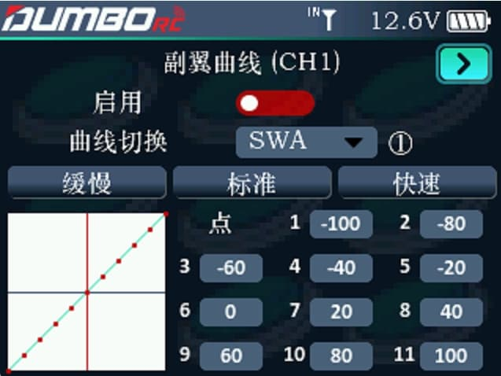

        比率/曲线用于调整舵机在中立位置时左右转向的灵敏度，使其动作变化成线性或非线性。可设置通道 1、通道 2 和通道 4。           启用：是否开启该通道的曲线/比率设置。           曲线切换：可以指定一个通道，用该通道的状态值切换曲线类型。           曲线类型：可选 缓慢、标准、快速，每个曲线均由多点组成，可以直观查看曲线，选择自己想要的灵敏度。  也可以选择好曲线后，对图上的11个点做细微的调整，让曲线符合自己的要求。

        选择右上角的翻页键，可以对二通和四通进行设置，方法一样。
