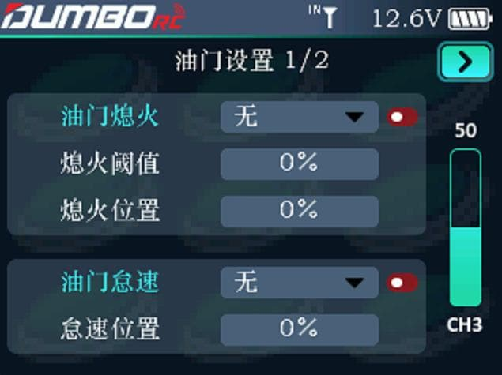
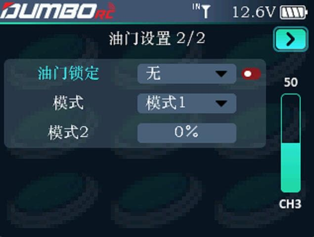

### 油门熄火

        油门熄火为停止引擎运转提供了一个简便的方法。一般来说可以在怠速状态下拨动一个硬件开关即可实现。此功能不能在油门高位时触发， 以防止错误的熄火操作。 

### 油门怠速

         油门怠速可降低发动机的转速，为飞机着陆、进行旋转等特技表演、停在跑道上（起飞待命状态）做准备。正常设置主要用于启动发动机和飞机滑行，并可将发生发动机熄火的可能性降至最低。         油门怠速：可以选择下拉选项里面的任意一个开关信号作为开启或关闭的开关。         怠速位置：可以手动输入一个合理的值，当开启油门怠速的时候，发动机会以这个速度运行。 

### 油门锁定

         即定速巡航功能，可以将油门输出设置为一个固定的值。油门锁定开启时，不论当前油门处于什么位置，油门输出都将跳变到锁定位置。例如，当用攀爬车时，可一键开启定速巡航，不用扳动油门，攀爬车即可保持匀速行驶。         油门锁定：可从下拉菜单选择任意通道开启或关闭油门锁定功能。         模式：分模式1和模式2。 

:::tip[提示]

模式1的输入源为油门通道，当油门到一定的速度后，开启油门锁定开关，则当前油门速度被锁定，车辆按当前速度匀速行驶。直到关闭油门锁定开关，才可以继续加减油门。 模式2的输入源为下面的输入框，输入合适的油门速度后，在操作过程中，可以一键开启油门锁定，车辆按输入的油门速度行驶。直到关闭油门锁定开关，才可以继续加油门。 当油门值为0的时候，开启油门锁定，就可以锁住油门，防止维修或防止不小心被碰到油门。

:::

        模式2(输入框)：油门的固定输出值。设置范围为 0 至 100，0 表示油门固定输出值为-100%，50 表示油门固定输出值为 0%，100 表示油门固定输出值为 100%。设置参数时，可通过右侧通道 3 的舵量条查看设置的油门输出值。     
