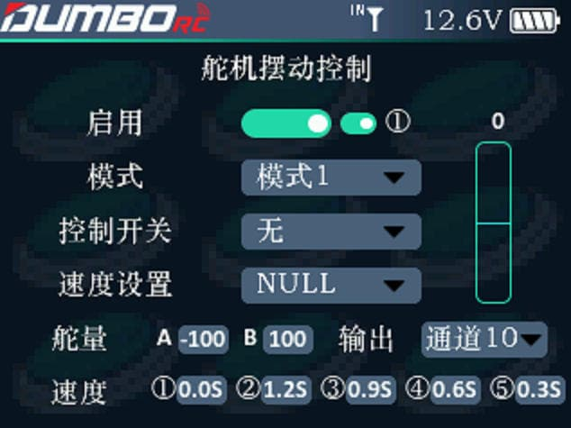

        启用：开启或者关闭舵机摆动控制，后面的数字1，代表控制开关的状态，如开关朝上，居中，朝下。         模式：有2种模式，模式1和模式2.           控制开关：可通过开关及开关的状态，确定舵机摆动的速度切换，在模式1的状态下使用。         速度设置：模式2的输入源通道。         舵量：输出通道的行程，对应的是舵机摆臂摆动的角度大小。         输出：选择舵机输出的通道。         速度：选择模式1时，此处的5个输入框对应舵机摆动的速度，可以输入想要的速度值。 

:::tip[提示]

模式1：输入源为底部的5个速度值，通过控制开关的每次拨动切换不同的速度。 模式2：输入源为速度设置后面的电位器通道所对应的行程。即：通过旋钮来实时调节舵机摆动的速度。

:::
