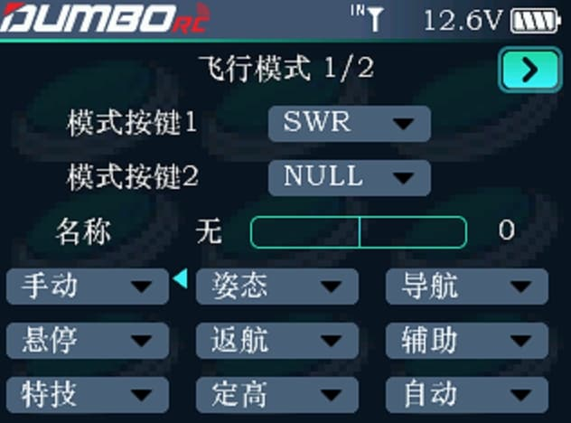
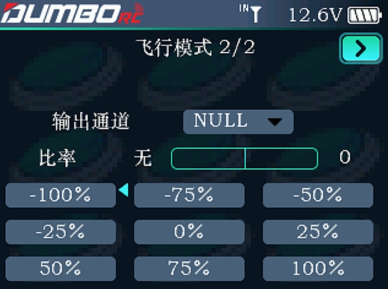

飞行模式用于设置切换不同的飞行模式，包括手动、姿态、导航、悬停、返航、辅助、特技、定高、自动、绕圈、漂移、引导、定点、返航、简单、运动和自稳一共 17 种模式。

:::caution[注意]

此功能需要配合飞控使用，多用于模型连接飞控后，对飞控不同飞行模式的切换。请务必将遥控器中模式名称与飞控中设定的飞行模式相匹配，避免对飞控的飞行模式切换错误导致意外损害和伤害。

:::

### 飞行模式1/2

模式按键 1/模式按键 2：均为飞行模式的切换开关，可下拉选择。可通合适的开关通道。通过 [遥控器设置] 下的[开关设置]，自定义这些按键为二档或三档开关。可以只设置 1 个模式按键或同时设置 2 个模式按键。

:::tip[提示]

若模式按键只设置 1 个二档开关，遥控器只能切换2种飞行模式；若模式按键同时设置为 2 个三档开关，遥控器可以切换最高 9 种飞行模式。

:::

移动光标至飞行模式名称，短按 Push 键后转动 Push 键可以选择飞行模式。当设置模式按键后，可以拨动开关，飞行模式后的红色小三角对应开关当前位置的飞行模式。

### 飞行模式2/2

输出通道：飞行模式的控制通道，可设置为通道 5 至通道 12。输出通道设置后，即可拨动开关，在当前界面查看通道输出的值。

比率：每个姿态对应的比率，将决定切换到该姿态模式时，姿态选择通道输出的值，可设置范围是 -100 到 +100。移动光标至比率值，短按确认键后转动滚轮可以设置比率。比率设置完成后，可以拨动开关，比率后的红色小三角对应开关当前飞行模式的比率值。

:::tip[提示]

对每种模式设定不同的比率时，尽可能避免不同姿态的比率设置的太过接近，这样飞控可以更准确的识别到要切换的姿态。

:::
