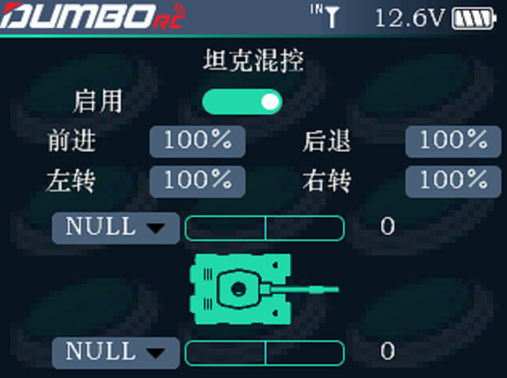

        此功能是针对一些特定的模型而设定的，如坦克模型，挖掘机模型，它的两个履带驱动既可以同向驱动也可以反向驱动，此时可用坦克混控功能。         启用：可设置开启或关闭。         前进：控制两个履带前进的油门输出值和油门原始值的比。         后退：控制两个履带后退的通道输出值和通道原始值的比。         左转：控制两个履带左转的通道输出值和通道原始值的比。         右转：控制两个履带右转的通道输出值和通道原始值的比。         通道：可选择通道 1 至通道 12，根据两个电机分别所连的接收机通道决定，默认通道 5 和通道 6。
