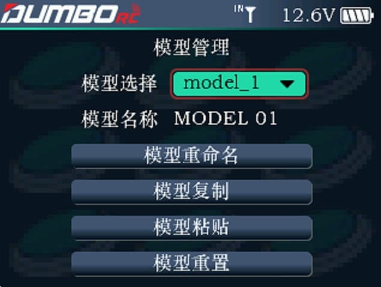

        对模型做全方位管理。包括模型选择、模型重命名、模型复制/粘贴和模型重置。

### 模型选择

        遥控器最多可储存 20 组模型数据，根据需要可随时调出其中的一个模型数据，并使用它。

### 模型重命名

        可对选择的模型，编写与更改模型名称。

### 模型复制/粘贴

        当一个新的模型与之前用过的模型相同或相似时，为了快速完成设定动作，可使用此功能进行复制。  例如，如果需要复制模型 1 的数据到模型 2，可选中模型 1，点击复制，然后选中模型 2，点击粘贴即可。  

### 模型重置

        此操作可清除当前模型的全部设置数据，使当前模型恢复默认值。
