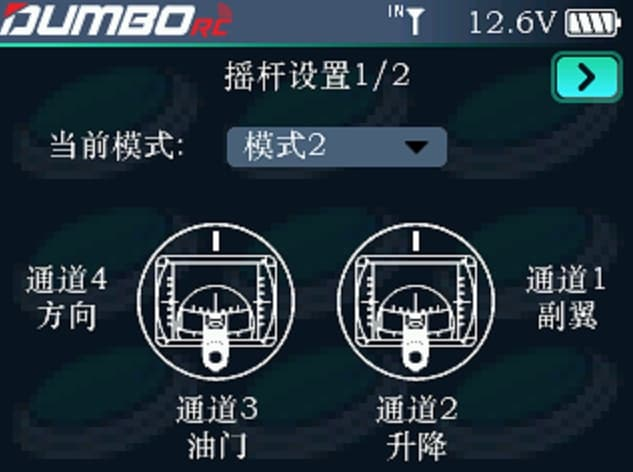
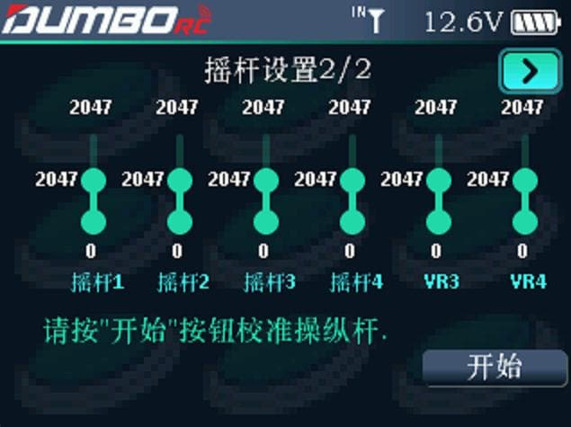
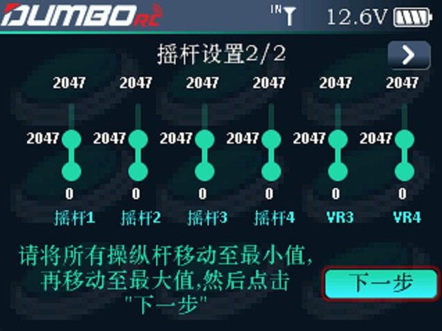
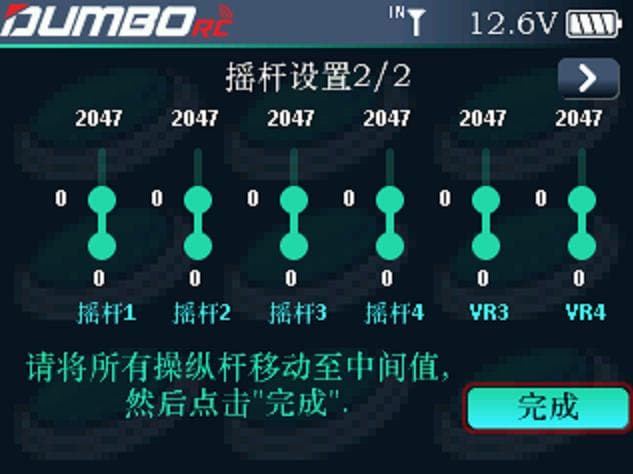

        遥控器提供了四种不同的摇杆模式，可根据使用习惯来设定需要的摇杆模式。当DRC16的摇杆回中不在中位，或者舵量偏差太大时需要校准摇杆。

### 摇杆设置1/2

        系统默认模式 2。模式 2/4与模式 1/3 来回切换时，会导致油门位置交换，比如油门从不回中摇杆变为了回中摇杆，此时用户还需要拆开机器并调整摇杆位置完成模式切换。

### 摇杆设置2/2

        当 DRC16 的摇杆回中时不在中位，或者舵量偏差太大时需要校准摇杆。DRC16摇杆校准方法如下： 

1.将光标移动至  开始    ，按滚轮按键确认。

        2.将4个摇杆通道移到最大值和最小值，将遥控器标识有VR3和VR4通道的2个电位器也上下拨到最大和最小值。完成所有的操作后，按下  下一步  。

        3.将所有摇杆置于中间位置！然后点击  完成 

:::caution[重要]

摇杆的油门通道一定要记得置于中间值位置，对于非双回中摇杆的遥控器来说，这里最容易忽视。遗漏此步操作会导致油门摇杆加油门的时候，油门直接由最小值跳到50%油门。

:::
