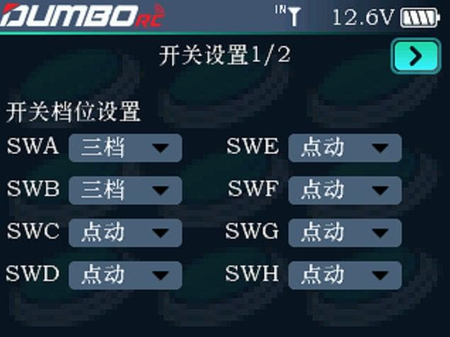
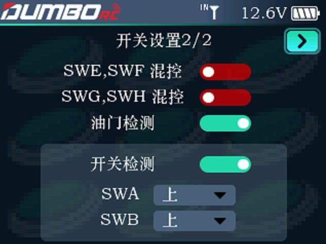

### 开关设置1/2

针对波段开关，可以设置二档或者三档。针对按键，可以设置点动、自锁、三档。

:::tip[说明]

点动信号：长按按键，通道动作，松开按键，通道恢复初始状态。

自锁信号：短按按键，通道动作，信号会一直保持，直到再次短按按键，通道恢复初始状态。

二档：通道只有最大值和最小值。如果三档开关设置为二档，则有一个档是没有输出的。

三档：通道输出最大值、中间值、最小值。

:::

### 开关设置2/2

SWE,SWF混控：支持此2个通道的程序混控。

SWG,SWH混控：支持此2个通道的程序混控。

油门检测：设置开机的时候是否检测油门通道，防止通电开机遥控器油门发出信号导致模型损坏的事故，默认开启。

开关检测：可以设置开机的时候SWA、SWB的开关状态，如果开关不在设置的状态，则开机的时候会弹出警告界面。

