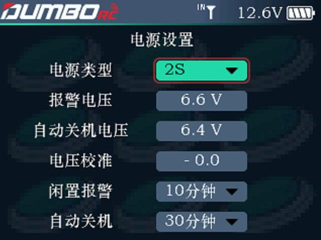

本界面用来设置遥控器电池类型及报警、关机电压，同时也设置遥控器长期不用的情况下，提示报警及关机的时间。

电池类型：遥控器支持4节碳性/碱性电池、2S-3S电池。

报警电压：碳性/碱性电池，建议设置4.5v报警，4.2v关机。2S-3S建议按每节电池3.7v的时候设置报警，3.4v的时候关机。例如2S电池，则报警电压为3.7\*2=7.4V，关机电压为：3.4\*2=6.8V。

电压校准：如果电池实际测量的电压和遥控器识别出来的电压有误差，则用滚轮将误差输入到后面。

闲置报警：遥控器通道无动作、菜单键无操作多长时间后报警。

自动关机：设置遥控器多长时间不使用后自动关机。

