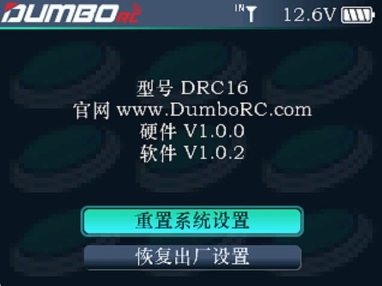

        可以查看遥控器型号及固件版本，并对遥控器进行系统重置和恢复出厂设置.

        型号：当前遥控器的型号。         软件：当前遥控器的固件版本。

### 重置系统设置

        重置系统设置：重置系统里面所有模型的"遥控器设置"里面的数据。

### 恢复出厂设置

        恢复出厂设置：删除系统里面所有模型的数据至出厂状态。

:::tip[关于几处重置的说明]

1.遥控器设置--模型管理--模型重置：重置当前模型选择里面选择的这个模型的数据。 2.遥控器设置--关于--重置系统设置：重置"遥控器设置"里面的有关遥控器(摇杆、开关、显示、声音、电源、用户按键、LED设置)的各种设置。 3.遥控器设置--关于--恢复出厂设置：恢复遥控器到出厂状态，所有的模型数据和遥控器设置均恢复到出厂状态。

:::
