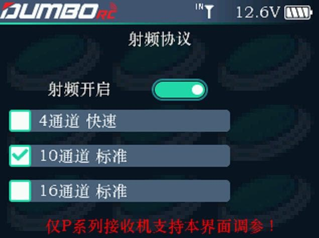

本界面用于设置内置射频开启与关闭，及接收机模式

射频开启：用于开启和关闭内置射频模块

4通道快速：接收机只有CH1-4 四个通道起作用，接收机输出快速响应信号，其他通道均无输出。

10通道标准：10个通道输出，小飞象迷你4通接收机，6通接收机，10通接收机在非快速模式下可以选择这个选项。

16通道标准：16个通道输出，小飞象所有接收机在非快速模式下都可以选择这个模式。

:::caution[提示]

如果16通接收机错误地选择了10通道标准，那么16通道的前10个通道是正常的，后面的11-16通道，会被1-6通道的信号覆盖

:::
