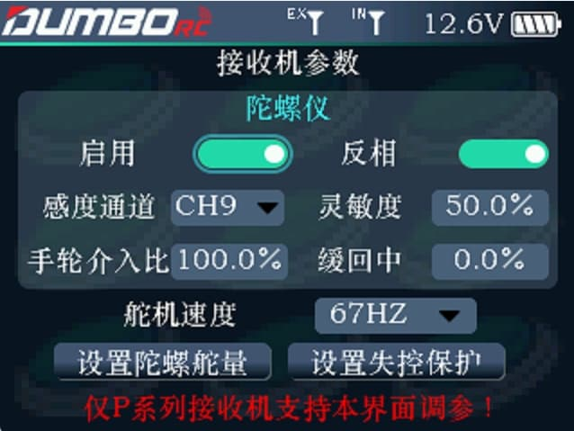

        本页面用于设置带陀螺仪接收机的各种参数，不带陀螺仪的接收机可以在本页面设置舵机速度和失控保护。

:::caution[注意]

仅P系列的接收机支持在本界面调参 X系列的接收机，通过按键定义在接收机上面设置各种功能

:::

#### 陀螺仪

        启用：用于开启或关闭接收机的陀螺仪功能。         反相：如果陀螺仪效应是反着的(当人为给车子一个向左的外力，在开启陀螺仪的情况下，车轮应该会有一个向右打方向的纠正动作，如果车轮反而是向左纠正，则方向是反着的)，则需要切换一下此处的相位。         感度通道：可以指定按键通道、开关通道、旋钮通道或者是NULL。 

:::tip[提示]

        如果是按键(开关)通道，则灵敏度为该按键(开关)通道的行程，请根据实际的陀螺仪效果设置好合理的行程，如果是2段行程，则一个值代表陀螺仪感度为0(无陀螺仪效应)，另一个值为陀螺仪感度。如果是3段行程，则可以设置2个陀螺仪感度值。         如果是旋钮通道，则可以通过调节旋钮的位置，动态的设置陀螺仪感度。         如果是NULL ，则可以在后面的灵敏度那里输入一个百分比值，来调节陀螺仪的感度。

:::

        手轮介入比： 调整手轮信号和陀螺仪效果的混合比率。百分比越大，手轮介入的比例就越高。         缓回中：用于调整车轮缓慢回中的速度。百分比越大，车轮回中的速度越慢。

#### 舵机速度

        舵机的响应速度，50HZ 67HZ为模拟舵机响应速度，250HZ和300HZ为数字舵机响应速度。请根据所使用的舵机选择合适的的速度。

:::important[注意]

正确选择舵机的速度，否则会导致舵机抖动、发热或者长时间错误地使用出现烧毁舵机的情况。 如果舵机是数字舵机，则四个响应速度都可以选择，兼容性没有问题。 如果舵机是模拟舵机，则必须选择50HZ或者67HZ，根据舵机的工作状态选择其中最合适的一个值。

:::

#### 设置陀螺仪舵量

        如果开启陀螺仪后，舵机左右的行程量不一致，可以在这里设置一下EPA。在接收机和遥控器对好码并都通电的前提下，用滚轮选择  `设置陀螺仪舵量`  的按键并确认，一通摇杆向左打满舵，接收机的对码灯会闪烁2下；一通摇杆向右打满舵，接收机的对码灯会闪烁2下，一通摇杆松开，让它回到中立点，接收机的对码灯会闪烁2下，至此完成了陀螺仪舵量的设置。

#### 设置失控保护

        失控保护功能是一项重要的安全设置，当接收机失去信号不受控制时可用来保护模型不受损失或降低损失程度，也可对人员安全起到一定的保护作用。此功能可设置当接收机失去控制时各个通道执行的输出值。所有通道默认为 0%，可根据设备使用需要自定义设置。         用滚轮选择 `设置失控保护`  的按键并确认，将需要设置失控保护的通道设置到想要的输出值，然后再次按一下 `设置失控保护` 的按键完成操作。
