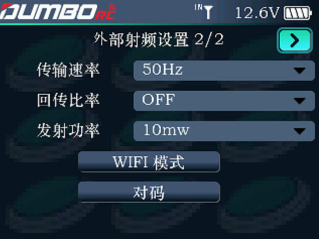
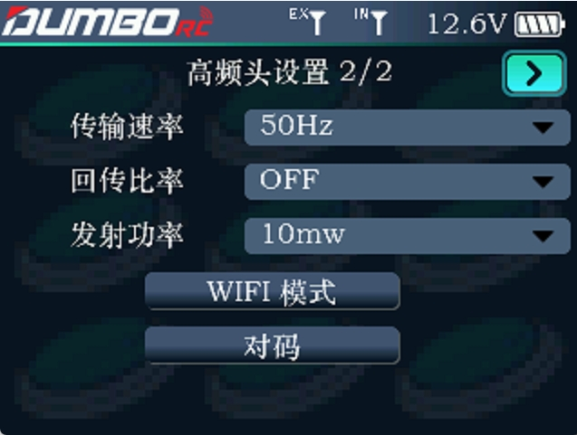

### 外置射频硬件设置1/2

        当遥控器没有连接任何外部模块时，或者外部高频头没有启用时，遥控器任务栏信号塔旁边会显示IN，如下图.

        当遥控器启用了外部射频，并连接了外置射频硬件，遥控器任务栏信号塔旁会显示EX，表示当前遥控器使用的是外部射频。此时我们可以对外置射频硬件进行更多的参数设置，例如射频硬件的类型、波特率、传输速率、回传比率、发射功率、对码及固件升级。

        外部射频启用：开启或关闭外置射频硬件。        外置射频硬件类型：支持ELRS 和 TBS协议射频硬件，根据使用的射频硬件选用不同协议。         波特率：可选115200、400K。当数据比率为50Hz时，选择115200；当数据比率为50~250Hz时，可选择400K. 

### 外置射频硬件设置2/2

        当DRC16连接外置射频且参数读取成功时，可以设置本页射频的参数：

        传输速率：外置射频和遥控器之间每秒发送数据包的数量。         回传比率：回传数据包的比例。         发射功率：外置射频发射的功率。         WIFI模式：滚轮选择后单击进入开启WiFi模式，用于固件更新。         对码：滚轮选择后单击进入，开启外置射频与接收机的对码。
