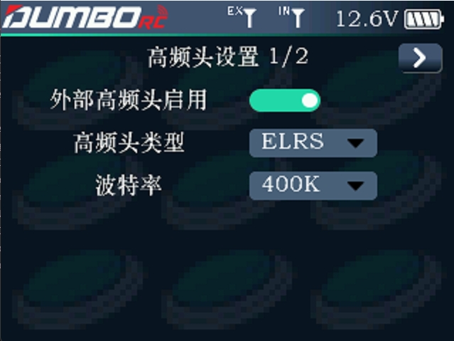
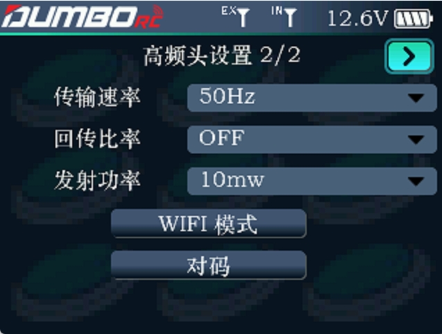

### 高频头设置1/2

当遥控器没有连接任何外部模块时，或者外部高频头没有启用时，遥控器任务栏信号塔旁边会显示IN，如下图.

当遥控器启用了外部高频头，并连接了外部高频头，遥控器任务栏信号塔旁会显示EX，表示当前遥控器使用的是外部高频头。此时我们可以对高频头进行更多的参数设置，例如高频头类型、波特率、传输速率、回传比率、发射功率、对码及固件升级。

:::caution[注意]

DRC16仅支持CRSF协议高频头，例如TBS，ELRS。

:::

外部高频头启用：开启或关闭外部高频头。

高频头类型：支持ELRS 和 TBS协议高频头，根据使用的高频头选用不同协议。

波特率：可选115200、400K。当数据比率为50Hz时，选择115200；当数据比率为50~250Hz时，可选择400K.

### 高频头设置2/2

当DRC16连接高频头且参数读取成功时，可以设置本页高频头的参数：

传输速率：高频头和遥控器之间每秒发送数据包的数量。

回传比率：回传数据包的比例。

发射功率：高频头发射的功率。

WIFI模式：滚轮选择后单击进入开启WiFi模式，用于固件更新。

对码：滚轮选择后单击进入，开启高频头与接收机的对码。
