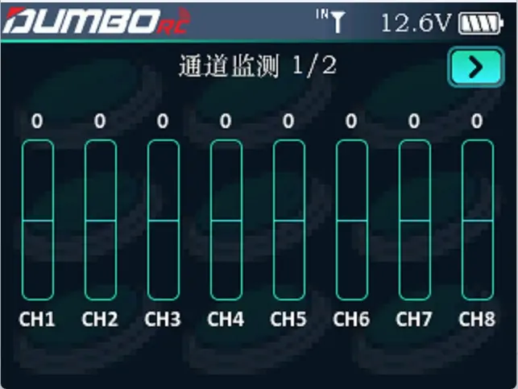
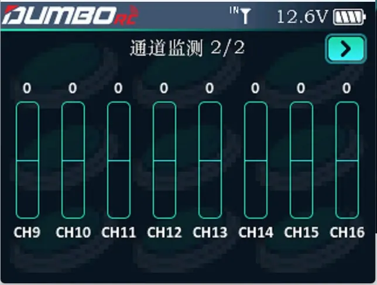

动态实时显示遥控器所有通道的输出值。以便我们能看到所有通道当前的输出情况，方便对输出的模型功能做出正确判断。 
注意：在遥控器主界面短按一次End 键可快捷查看通道监测。

用滚轮移动到右上角的 ` > `   翻页键，可以看CH9-CH16通道的输出值。

:::tip[可以在此界面查看：]

1.通道的中立点、正反向、行程

2.通道之间的混控情况

3.开关信号每个状态对应的行程

:::
