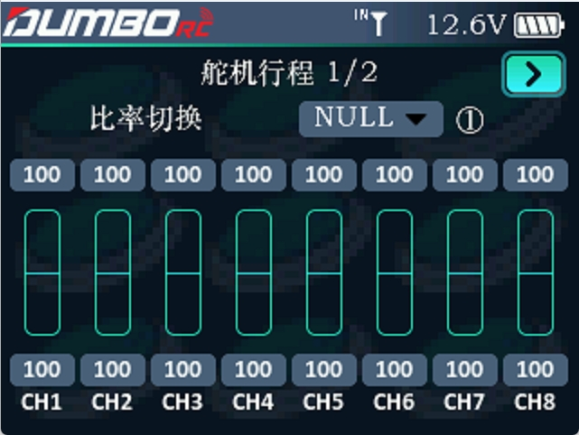
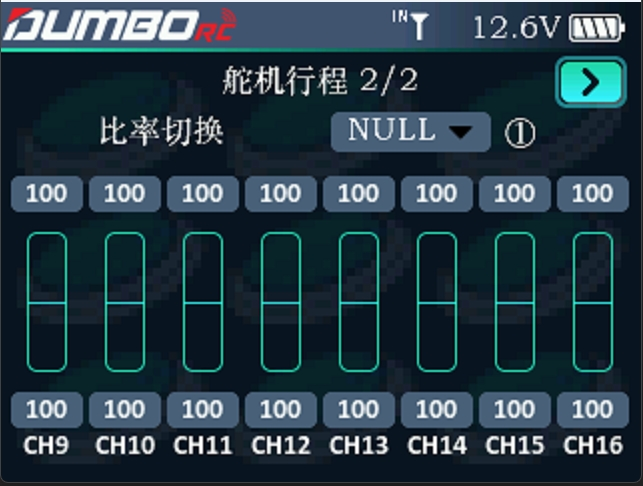

        调整舵机输出的行程量，在调试模型过程中使用此功能。可分别设置各通道高低行程值。 
        因模型在设计时存在结构的尺寸变化及规范不统一及每个操作者的习惯动作大小不同，此功能便可用于设置各通道所需要的行程量进行相应结构匹配调整，以达到最佳与之匹配的操控效果。如在操作时，希望转弯动作不
要过大，可将方向通道的高低端值调小一些。这样转弯动作相应小了，不容易出现摆尾现象。 
        将光标移至需要设置的数值，拨动滚轮即可设置合适的数值，各通道上下行程量可设置范围为0-120。
           
         

        通过显示屏右上角的   `   >   `  翻页键可以进入下一个页面调节CH9-CH16的行程。
