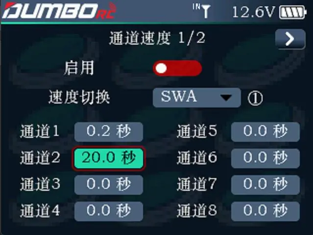
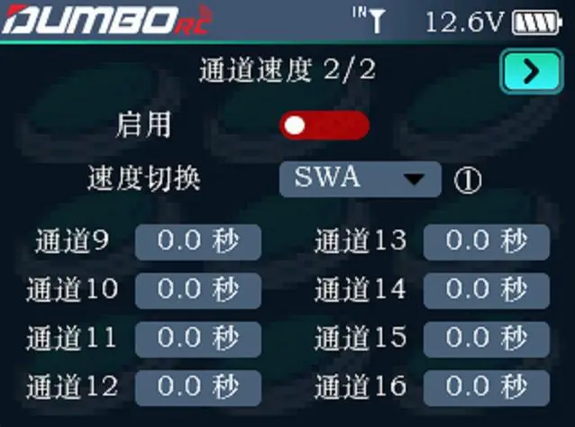

        此功能可对模型的通道输出速度做相应的调整，如在开启收放起落架时，希望它是缓慢开启的，此时把相应通道的输出速度调慢即可实现。
        启用：开启或关闭该功能。

        速度切换：可设置一个开关来控制该功能，可设置开关包括不限于 SWA、SWB、SWC 和SWD。NULL表示无开关控制。        

        通道后面的数值表示速度，默认为 0 秒，即无通道延迟。可设置最高 20 秒的通道速度。

        

        通过显示屏右上角的 `>` 翻页键可以进入下一个页面调节CH9-CH16的微调值。

        
